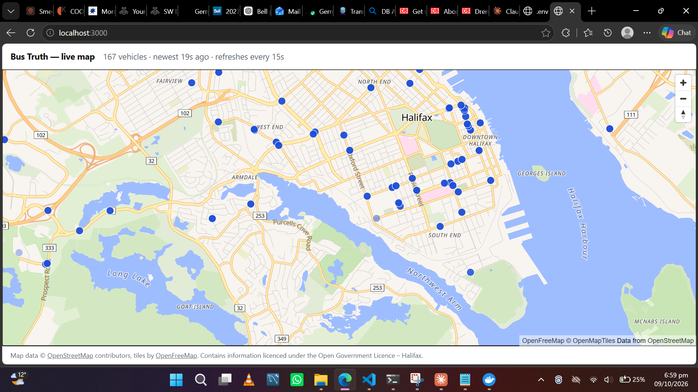

# Bus Truth


Bus Truth records Halifax Transit's live GTFS-Realtime feeds continuously and keeps every
snapshot, so what the buses actually did can be compared against what was promised. This
repository is the data pipeline that captures and serves that record: three protobuf feeds
into Kafka, into PostgreSQL, out through a REST API onto a live map.

> Contains information licenced under the Open Government Licence – Halifax.

## What this does and does not measure

**It does:** capture all three realtime feeds every 20 seconds, archive the raw protobuf
bytes permanently, load vehicle positions into PostgreSQL with a replay guarantee, serve
the latest position per vehicle as GeoJSON, and draw them on a map that distinguishes "no
buses running" from "no data arriving".

**It does not** compute on-time performance, bunching, ghost buses or prediction accuracy.
Those need arrival detection — deciding, from a trail of positions, that a bus *arrived* at
a stop — plus matching each trip to the published schedule. That work was scoped, measured,
and then deliberately cut; the reasoning and the measurements are in
[what I would do next](#what-i-would-do-next).

So this is **a working realtime data pipeline with 16 days of archived evidence**, not a
transit-reliability dashboard. The findings below are what the archive supports today.

## Architecture

```
GTFS-RT feeds (3, every 20s) ─► collector (Java) ─► Kafka ─► loader (Java) ─► PostgreSQL
                                     │                                            │
                            archives raw .pb.gz                                    ▼
                                                                  api (Spring Boot) ─► web (Next.js + MapLibre)
```

| module | what it does |
|---|---|
| `common` | shared immutable records — the shapes the services agree on |
| `collector` | polls the three feeds, decodes protobuf, publishes to Kafka, archives raw bytes |
| `loader` | consumes Kafka, writes PostgreSQL idempotently |
| `api` | REST + OpenAPI; serves the live positions as GeoJSON |
| `web` | Next.js map, one dot per vehicle, faded by that vehicle's own age |
| `scripts` | `save_feeds.py`, the standalone archiver that has run since 24 September |
| `infra` | docker-compose: PostgreSQL 18, Kafka 4 in KRaft mode, Kafka UI |
| `docs` | decision records, per-stage write-ups, defence notes |

Design decisions are recorded in [docs/decisions](docs/decisions/) and each stage is written
up in [docs/stages](docs/stages/), including what broke and why.

## Running it

Requires Docker, JDK 21 and Node 24.

```bash
cp .env.example .env                  # then set a local password

docker compose -f infra/docker-compose.yml up -d --wait

# PostgreSQL is published on 55432, not 5432 — see docs/stages/stage-3.md
psql -h localhost -p 55432 -U bustruth -d bustruth

# each service needs the password; local development uses a git-ignored
# application-local.yml per module, activated with the "local" profile
./mvnw -pl common -am install -DskipTests
./mvnw -f collector/pom.xml spring-boot:run                               # :8081
./mvnw -f loader/pom.xml    spring-boot:run -Dspring-boot.run.profiles=local  # :8082
./mvnw -f api/pom.xml       spring-boot:run -Dspring-boot.run.profiles=local  # :8084

cd web && npm ci && npm run dev                                           # :3000
```

The map is at `http://localhost:3000`, the API at `http://localhost:8084/api/vehicles/live`,
and its OpenAPI document at `http://localhost:8084/v3/api-docs`.

Tests: `./mvnw verify` runs everything, including integration tests that start a real
PostgreSQL 18 through Testcontainers, so Docker must be running.

## Findings

_Daniel writes this section._

<!-- Each finding: what was measured, the number, and why it matters. Candidates, all
     measured from the archive and recorded in docs/stages/:
       - 380 of 886 trip updates carry no trip_id
       - the published delay field covers 34.8% of stop-time updates, 0% overnight
       - alert content changed 0% across 180 consecutive polls
       - 4.4% of live trip ids cannot join the published schedule
       - currentStatus is present on 11 of 69 vehicles -->

## Data quality

Collection has run since **24 September 2026** and is ongoing. The archive holds
**152,036 realtime snapshots** across the three feeds plus **16 daily captures** of the
static schedule.

Coverage is **incomplete and uneven**, and that is stated rather than hidden: the archiver
runs on a laptop, so it stops when the machine sleeps or is closed.

| | vehicle positions |
|---|---|
| days captured | 16 (24 September – 9 October 2026) |
| snapshots | 50,925 |
| coverage against a continuous 20-second capture | **73.7%** |
| best day | 99.9% (1 October) |
| worst day | 42.4% (5 October) |

Gaps are not interpolated or filled. A missing snapshot is simply absent, and any future
analysis has to treat the archive as a sample rather than a census — which is why the
per-day table above exists instead of a single headline number.

Two known data-quality limits, both measured, both documented in
[docs/stages/stage-3.md](docs/stages/stage-3.md):

- **4.4% of live trip ids carry an `_N` suffix** from the agency's trip-modification
  extension, and none of the 9,239 trip ids in the published schedule contains an
  underscore. A naive join drops those trips silently.
- **The agency's own `delay` field is present on 34.8% of stop-time updates**, ranging from
  0% between 02:00 and 04:00 to about 70% late evening — so it cannot be used as a fallback
  without introducing a bias that varies by time of day.

## What I would do next

**Arrival detection**, which is the piece that turns this pipeline into a reliability
measure. From a vehicle's trail of positions, decide that it arrived at a stop, then compare
that against the scheduled time to produce on-time performance, bunching and ghost-trip
counts.

It was cut for one honest reason: it is the stage where the judgement lives — how close
counts as "at the stop", what to do when positions skip a stop entirely, how to handle the
suffixed trip ids above — and a rushed version produces numbers that look authoritative and
are wrong. Publishing "Route 1 is on time 62% of the time" with a flawed detector is worse
than publishing nothing.

Also next: the trip-updates loader (the tables are designed and sized — 6.1M rows/day with
the right dedupe key, measured, see [docs/stages/stage-3.md](docs/stages/stage-3.md)), the
static GTFS loader, and dbt marts on top.

## Attribution

Contains information licenced under the Open Government Licence – Halifax.

Map data © [OpenStreetMap](https://www.openstreetmap.org/copyright) contributors, tiles by
[OpenFreeMap](https://openfreemap.org/).
